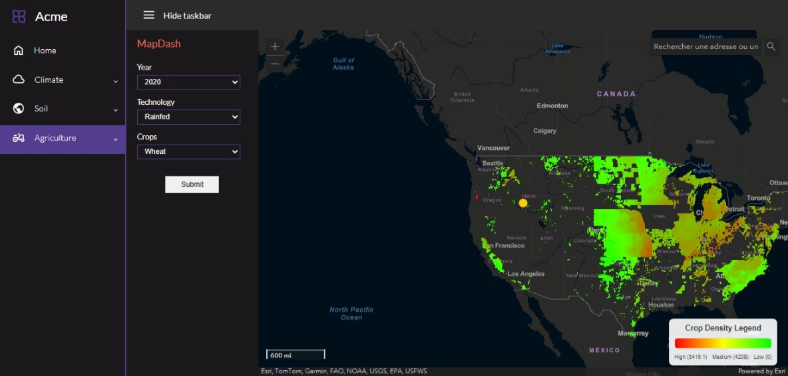

# SAMS
Smart Agriculture Monitoring System: Harvesting and Analysing World AgriData

SAMS is an open source agriculture dashboard. Its purpose is to describe the best possible impact of climatic conditions and soil characteristics on the yield of a total of 42 crops. It carries with it all analysis and forecasts for each variable selected. The main objective of this project is to give insights on climate data and agricultural data.

This project was powered by [Power Larc NASA](https://power.larc.nasa.gov/) (for climatic and soil data) and [MapSpam](https://mapspam.info/) for Agriculture Data

## Development

This project was developed using Flask mainly as Web Development framework. The dashboard uses Python 3.11.9 as Language for processes (core) and HTML, JS and CSS for pages (front).

### Run the app locally

In case, you are interested in running the code locally, you are welcome to do it. Once you've downloaded the zip file for this repo, unzip it on your local machine. Then open the unzipped file, create a virtual environment and install packages that are in the file requirements.txt
To run the app, you still need to connect to the MongoDB cluster created for this purpose

You can now run your local url by entering the following cmd command: python app.py
This will launch a local url and your application with it

### Data Files

This application requires some data to work correctly. The climatic data is extracted directly through NASA Servers. Agricultural data on the other hand is stored on an AWS S3 Public Bucket. We just make HTTP Requests on AWS to get those data. Be aware that using this method could be slow since you will have to wait for the data to be downloaded by the app on AWS S3 before rendering anything else.

If you want the app to be fast, contact us to get the data locally.

## Build the project

The application is built upon Python 3.11.9. A version of Python equal or greater to this one is required for the project built. Note that you should probably make sure that Python is existing on your computer and that its version is >= 3.11.9.
Open a terminal with your machine and type <python --version>

- First downlaod the zip file of the repository and unzip it locally
- Navigate to the project folder: Open a terminal and navigate to the folder where the repository is unzipped.
- Create a Virtual Environment: type <python -m venv env>: This will create a virtual environment in a folder named env.
- Activate the Virtual Environment: 
On Windows: <.\env\Scripts\activate>
On macOS/Linux: "source env/bin/activate"

- Install Packages from requirements.txt: <pip install -r requirements.txt>
- Launch the application: <python app.py>

